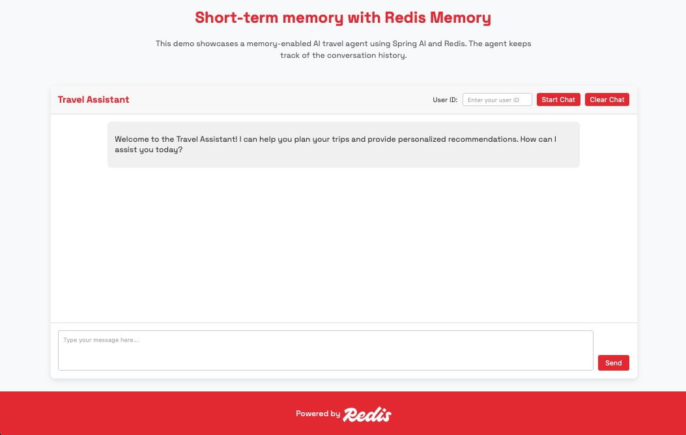
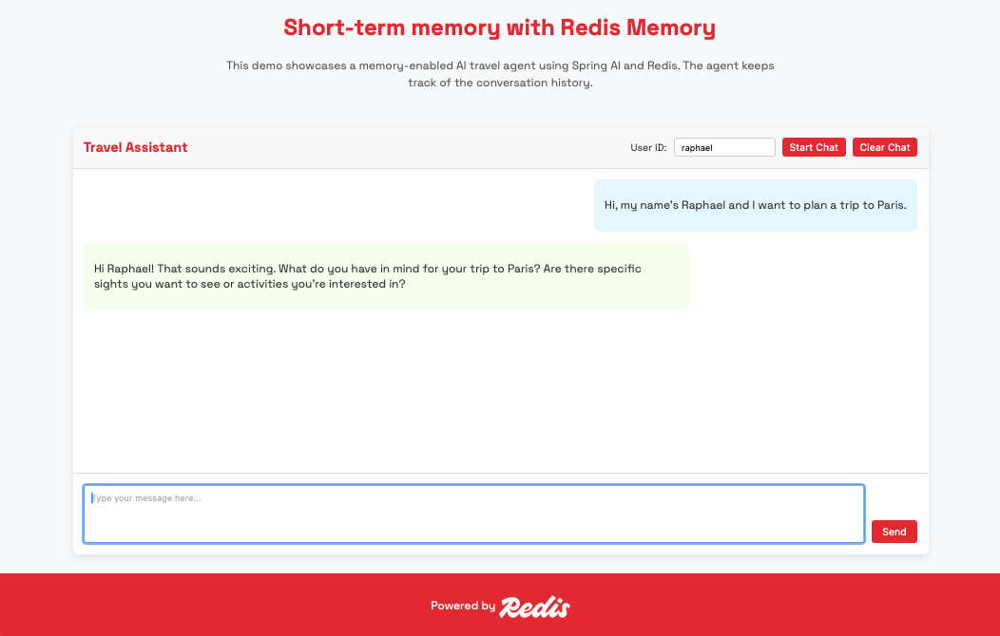
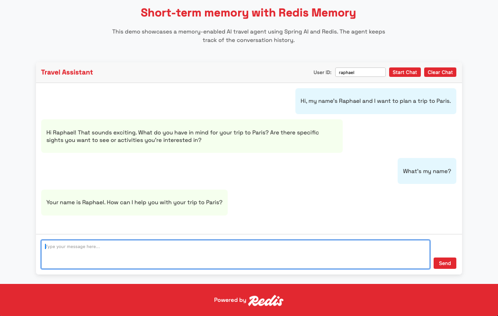
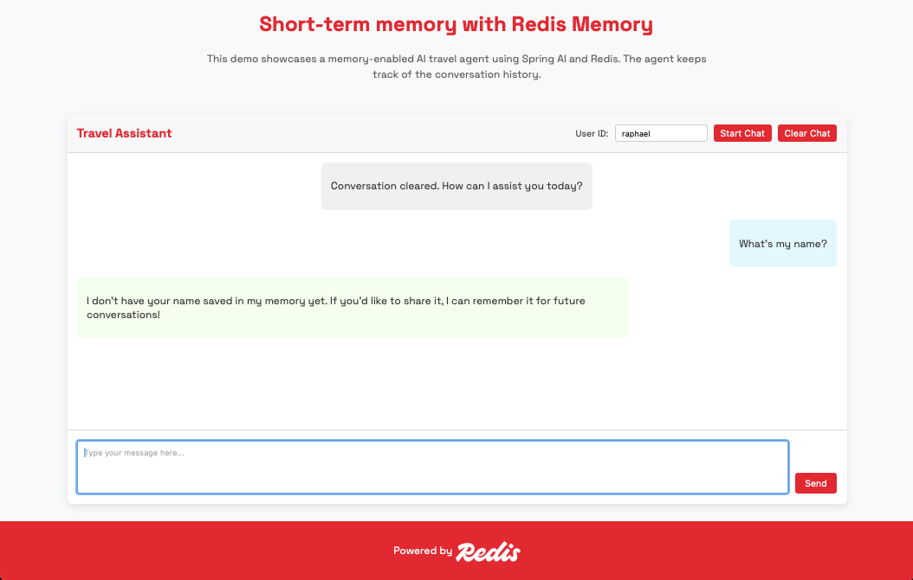
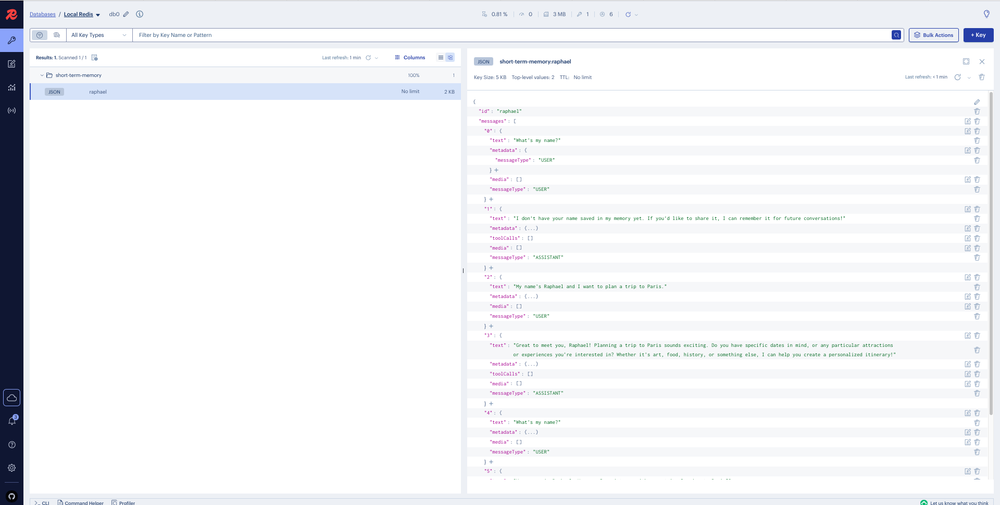

# Short-term Memory (Chat History) with Spring AI

Modern AI assistants rely on chat history to go beyond single-turn responses and behave more like intelligent, adaptive conversational partners. Chat history enables assistants to maintain context, remember what was said earlier in the conversation, and provide coherent, personalized replies. Without it, each interaction starts from scratch—forgetting prior messages, goals, and clarifications—which limits both usefulness and realism.

## Repository

The repository for this demo can be found [here](https://github.com/redis-developer/redis-springboot-resources/tree/main/artificial-intelligence/chat-history-with-spring-ai)

## Requirements

To run this demo, you’ll need the following installed on your system:
- Docker – [Install Docker](https://docs.docker.com/get-docker/)
- Docker Compose – Included with Docker Desktop or available via CLI installation guide
- An OpenAI API Key – You can get one from [platform.openai.com](https://platform.openai.com)

## Running the demo

The easiest way to run the demo is with Docker Compose, which sets up all required services in one command.

### Step 1: Clone the repository

If you haven’t already:

```bash
git clone https://github.com/redis-developer/redis-springboot-recipes.git
cd redis-springboot-recipes/artificial-intelligence/chat-history-with-spring-ai
```

### Step 2: Configure your environment

You can pass your OpenAI API key in two ways:

#### Option 1: Export the key via terminal

```bash
export OPENAI_API_KEY=sk-your-api-key
```

#### Option 2: Use a .env file

Create a `.env` file in the same directory as the `docker-compose.yml` file:

```env
OPENAI_API_KEY=sk-your-api-key
```

### Step 3: Start the services

```bash
docker compose up --build
```

This will start:

- redis: for storing the chat history
- redis-insight: a UI to explore the Redis data
- chat-history-app: the Spring Boot app that implements the chat history enabled AI Agent

## Using the demo

When all of your services are up and running. Go to `localhost:8080` to access the demo:



Type a user ID in the user ID box and then click on `start chat` to start a new chat:


Type a message stating your name and hit send:



If we send a new message asking what our name is, the agent should be able to remember our name:



Finally, if we clear the chat, the chatbot won't have access to the short-term memory anymore. We will see that the agent has forgotten about our information:



### Redis Insight

RedisInsight is a graphical tool developed by Redis to help developers and administrators interact with and manage Redis databases more efficiently. It provides a visual interface for exploring keys, running commands, analyzing memory usage, and monitoring performance metrics in real-time. RedisInsight supports features like full-text search, time series, streams, and vector data structures, making it especially useful for working with more advanced Redis use cases. With its intuitive UI, it simplifies debugging, optimizing queries, and understanding data patterns without requiring deep familiarity with the Redis CLI.

The Docker Compose file will also spin up an instance of Redis Insight. We can access it by going to `localhost:5540`:

There, we will be able to see the data stored in Redis.

The short-term memory (chat history) is stored in a list in a JSON data structure:



## How It Is Implemented

Agents rely on short and long-term memory. Short-term memory is typically the chat history, the list of messages exchanged between the agent and the user or the context the agent is using during its current session.

To implement both of these memories, we're going to rely on the Spring AI Advisors API. Advisors are a way to intercept, modify, and enhance AI-driven interactions.

We are going to create two advisors. The first one, for shot-term memory, is going to rely on the ChatMemory abstraction provided by Spring AI while the second one is going to be implemented from scratch by ourselves.

### Short-term memory

Spring AI's ChatMemory abstraction provides chat memory features that allow us to store and retrieve information across multiple interactions with the LLM.
The ChatMemory abstraction allows us to implement various types of memory to support different use cases. The underlying storage of the messages is handled by the ChatMemoryRepository, whose sole responsibility is to store and retrieve messages.
It’s up to the ChatMemory implementation to decide which messages to keep and when to remove them. Examples of strategies could include keeping the last N messages, keeping messages for a certain time period, or keeping messages up to a certain token limit.

In the future, Spring AI will come with a RedisChatMemory implementation out of the box. This is planned to be released on version 1.1. Meanwhile, we will see how we can implement it ourselves in this tutorial.

#### Modeling the document

The short-term memory will be stored in Redis as a list in a JSON document. To do so, we're going to rely on the `@Document` annotation provided by Redis OM Spring.

The `ChatHistory` document will have two fields:

- id: to keep track of which session this memory belongs to
- messages: the list of messages exchanged during this session

Besides that, the annotation will receive two parameters:

- value: the keyspace where these documents are going to be stored within Redis
- indexName: the name of the index created by Redis to use the Redis Query Engine to efficiently fetch this memory later on

```kotlin
@Document(value = "short-term-history", indexName = "shortTermHistoryIdx")
data class ChatHistory(
    @Id
    val id: String? = null,
    val messages: List<StoredMessage>,
)

data class StoredMessage(
    val text: String = "",
    val metadata: Map<String, Any> = emptyMap(),
    val toolCalls: List<AssistantMessage.ToolCall>? = null,
    val toolResponses: List<ToolResponseMessage.ToolResponse>? = null,
    val media: List<Media>? = null,
    val messageType: MessageType
) {
    fun toAi(): Message = when (messageType) {
        MessageType.USER -> UserMessage.builder().text(text).metadata(metadata).media(media ?: emptyList()).build()
        MessageType.ASSISTANT -> AssistantMessage(text, metadata, toolCalls ?: emptyList(), media ?: emptyList())
        MessageType.SYSTEM -> SystemMessage.builder().text(text).metadata(metadata).build()
        MessageType.TOOL -> ToolResponseMessage(toolResponses ?: emptyList(), metadata)
    }
}
```

Then, we're going to define the ShortTermMemoryRepository interface to allow us to interact with our documents within Redis in a Spring Data fashion:

#### Using Spring Data to interact with Redis

```kotlin
interface ChatHistoryRepository : RedisDocumentRepository<ChatHistory, String>
```

#### Implementing Spring AI's ChatMemoryRepository

Now, let's implement our ChatMemoryRepository that will follow the contract provided by Spring AI's `ChatMemoryRepository`:

This class will implement the `ChatMemoryRepository` interface and rely on two beans:

- shortTermMemoryRepository: the repository we defined in the previous step
- entityStream: a bean provided by Redis OM Spring that allows us to query data from Redis efficiently

The `ChatMemoryRepository` interface requires us to implement four methods:

- findConversationIds
- findByConversationId
- saveAll
- deleteByConversationId

To implement them, we're going to use the `shortTermMemoryRepository` and `entityStream` beans that were previously injected.

```kotlin
@Component
class RedisChatMemoryRepository(
    private val shortTermMemoryRepository: ShortTermMemoryRepository,
    private val entityStream: EntityStream
) : ChatMemoryRepository {

    override fun findConversationIds(): List<String> {
        return entityStream.of(ChatHistory::class.java)
            .map(ChatHistory::id)
            .collect(Collectors.toList())
            .filterNotNull()
    }

    override fun findByConversationId(conversationId: String): List<Message> {
        val optHist = shortTermMemoryRepository.findById(conversationId)
        return if (optHist.isPresent) { optHist.get().messages.map { msg -> msg.toAi() } } else { emptyList() }
    }

    override fun saveAll(
        conversationId: String,
        messages: List<Message>
    ) {
        val storedMessages = messages.map { msg ->
            val storedMessage = when (msg) {
                is AssistantMessage -> {
                    StoredMessage(
                        text = msg.text ?: "",
                        metadata = msg.metadata,
                        media = msg.media,
                        toolCalls = msg.toolCalls,
                        messageType = MessageType.ASSISTANT
                    )
                }

                is UserMessage -> {
                    StoredMessage(
                        text = msg.text,
                        metadata = msg.metadata,
                        media = msg.media,
                        messageType = MessageType.USER
                    )
                }

                is SystemMessage -> {
                    StoredMessage(
                        text = msg.text,
                        metadata = msg.metadata,
                        messageType = MessageType.SYSTEM
                    )
                }

                is ToolResponseMessage -> {
                    StoredMessage(
                        toolResponses = msg.responses,
                        metadata = msg.metadata,
                        messageType = MessageType.TOOL
                    )
                }
                else -> error("Unknown message type ${msg.javaClass.canonicalName}")
            }
            storedMessage
        }

        val optHist = shortTermMemoryRepository.findById(conversationId)
        if (optHist.isPresent) {
            shortTermMemoryRepository.save(optHist.get().copy(messages = storedMessages))
        } else {
            shortTermMemoryRepository.save(ChatHistory(id = conversationId, messages = storedMessages))
        }
    }

    override fun deleteByConversationId(conversationId: String) {
        shortTermMemoryRepository.deleteById(conversationId)
    }
}
```

#### Configuring a Chat Memory bean

To plug our `ChatHistoryRepository` as an advisor for our `ChatClient`, we will need to expose it as part of a ChatMemory object. To do so, we will configure the following bean:

```kotlin
@Configuration
class ChatHistoryConfig {

    @Bean
    fun chatMemory(repo: RedisChatMemoryRepository): ChatMemory {
        return MessageWindowChatMemory.builder()
            .chatMemoryRepository(repo)
            .maxMessages(20)
            .build()
    }
}
```

#### Plugging the ChatMemory to our ChatClient

Finally, we can configure our ChatClient and plug our ChatMemory as an advisor that will intercept messages, store them in memory and retrieve them from memory as necessary:

```kotlin
@Configuration
class ChatConfig {

    @Bean
    fun chatClient(
        chatModel: ChatModel,
        chatMemory: ChatMemory
    ): ChatClient {
        return ChatClient.builder(chatModel)
            .defaultAdvisors(
                MessageChatMemoryAdvisor.builder(chatMemory).build(),
            ).build()
    }
}
```

### Agent Memory Orchestration

Since the advisor has been plugged in the `ChatClient` itself, we don't need to worry about managing memory ourselves when interacting with the LLM. The only thing we need to make sure is that with every interaction we send the expected parameters, namely the session or user ID, so that the advisor knows which history to look at.

```kotlin
    fun sendMessage(
        message: String,
        userId: String,
    ): ChatResult {
        // Use userId as the key for conversation history and long-term memory
        log.info("Processing message from user $userId: $message")
        val response = chatClient
            .prompt(
                Prompt(
                    travelAgentSystemPrompt,
                    UserMessage(message)
                )
            )
            .advisors { it
                .param(ChatMemory.CONVERSATION_ID, userId)
            }
            .call()

        return ChatResult(
            response = response.chatResponse()!!
        )
    }
```

This orchestration allows the agent to maintain context across multiple interactions and personalize responses based on user history.
