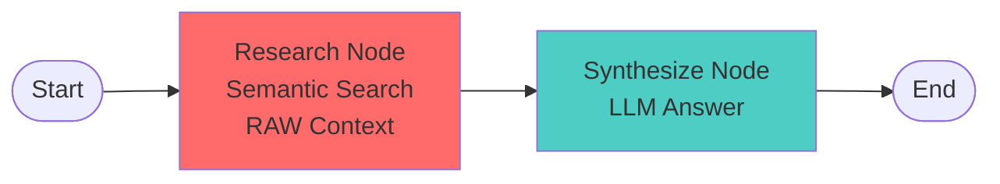

# Stage 1: Baseline RAG Agent (Information Overload)

## 🎯 Purpose

This is the **baseline** RAG agent that demonstrates **INFORMATION OVERLOAD** - what happens when you return EVERYTHING for EVERYONE without any context engineering or hierarchical retrieval.

**Key Learning**: "More information ≠ better answers. Progressive disclosure and context engineering are essential."

## ⚠️ What's Wrong with This Agent?

This agent demonstrates the problem of **information overload**:

### 1. **Returns EVERYTHING for ALL Courses**
- Returns FULL course details for ALL 5 courses
- Includes complete 14-week syllabi for EVERY course
- All assignments, grading policies, textbooks for ALL courses
- No discrimination based on relevance

### 2. **Massive Token Waste**
- ~6,000+ tokens for 5 courses (vs ~700 with hierarchical retrieval)
- Spends tokens on courses user doesn't care about
- Includes syllabi for courses that aren't even relevant
- 8-10x more tokens than necessary

### 3. **Information Overload**
- LLM gets overwhelmed with too much data
- User has to wade through massive amounts of information
- No progressive disclosure (everything at once)
- Poor user experience

### 4. **No Prioritization**
- Treats all courses equally regardless of relevance
- Doesn't adapt detail level to match importance
- No hierarchy or structure
- Flat, undifferentiated information dump

## 🏗️ Architecture

### Simple 2-Node Workflow



### What It Does

1. **Research Node**:
   - Performs semantic search using Redis vector embeddings
   - Retrieves top 5 courses
   - Matches to hierarchical courses with FULL syllabi
   - Returns **COMPLETE details for ALL 5 courses** (information overload!)

2. **Synthesize Node**:
   - Sends massive context to LLM (~6,000+ tokens)
   - Generates answer based on overwhelming data

### What It Doesn't Do

- ❌ No progressive disclosure (no hierarchy)
- ❌ No context budget management
- ❌ No prioritization by relevance
- ❌ No adaptive detail levels
- ❌ No context cleaning or optimization
- ❌ No query decomposition
- ❌ No quality evaluation

## 📊 Example: The Problem

### Query
```
"What machine learning courses are available?"
```

### Context Sent to LLM (~6,000+ tokens)

Returns FULL details for ALL 5 courses including:

**Course 1: CS001 - Machine Learning Fundamentals**
- Full description
- Complete 14-week syllabus with topics, subtopics, readings
- All 10 assignments (homeworks, exams, projects)
- Grading policy breakdown
- Textbook list
- Prerequisites
- Learning objectives
- Schedule and location

**Course 2: CS002 - Deep Learning**
- [Same complete details with 15-week syllabus]

**Course 3: CS003 - Computer Vision**
- [Same complete details with 14-week syllabus]

**Course 4: CS004 - Natural Language Processing**
- [Same complete details with 14-week syllabus]

**Course 5: CS005 - Reinforcement Learning**
- [Same complete details with 14-week syllabus]

**Total**: ~6,000+ tokens of raw JSON data

### Problems Visible to Students

1. **Information Overload**: User only needs 2-3 courses, but gets full details for all 5
2. **Token Waste**: Spends ~5,000 tokens on courses user doesn't care about
3. **No Hierarchy**: Everything at the same detail level, no progressive disclosure
4. **Poor UX**: User has to wade through 70+ weeks of syllabus content
5. **Inefficient**: 8-10x more tokens than hierarchical approach (~700 tokens)

## 🚀 Usage

### Installation

```bash
cd python-recipes/context-engineering/reference-agent/progressive_agents/stage1_baseline_rag
```

### Environment Setup

Make sure you have the `.env` file in `reference-agent/` with:
```bash
OPENAI_API_KEY=your_key_here
REDIS_URL=redis://localhost:6379
```

### Running the Agent

**Interactive Mode** (default):
```bash
python cli.py
```

**Single Query**:
```bash
python cli.py "What machine learning courses are available?"
```

**Simulation Mode** (run example queries):
```bash
python cli.py --simulate
```

**With Cleanup** (remove courses from Redis on exit):
```bash
python cli.py --cleanup
```

**Help**:
```bash
python cli.py --help
```

## 📈 Expected Results

### Sample Output

```
❓ Question: What machine learning courses are available?

🔍 Searching for courses: 'What machine learning courses are available?'
✅ Found 5 courses
📊 INFORMATION OVERLOAD: 24,532 chars (~6133 tokens)
⚠️  Returning FULL details (including syllabi) for ALL 5 courses!
⚠️  This wastes tokens on courses the user doesn't care about!
⚠️  No progressive disclosure, no context engineering!
🔬 Research complete in 245.32ms
🔗 Synthesizing answer from raw context...
🔗 Synthesis complete in 2134.56ms

============================================================
📝 Answer:
============================================================
Based on the course information provided, there are 5 machine learning
related courses available:

1. CS001: Machine Learning Fundamentals
   - Instructor: Dr. Smith
   - Credits: 4, Level: Advanced
   - 14-week course covering ML algorithms, neural networks, etc.
   - 10 assignments including midterm and final project

2. CS002: Deep Learning and Neural Networks
   - Instructor: Dr. Johnson
   - Credits: 4, Level: Graduate
   - 15-week course on advanced neural architectures
   - Prerequisites: CS001

[... continues with courses 3, 4, 5 ...]

============================================================
📊 Metrics:
============================================================
   Courses Found: 5
   Estimated Tokens: ~6133

⚠️  INFORMATION OVERLOAD: 8-10x more tokens than necessary!
⚠️  Includes full syllabi for ALL courses (even irrelevant ones)
   See Stage 2 for context engineering (64% reduction)
   See Stage 3 for hierarchical retrieval (progressive disclosure)
```

## 🔍 What Students Should Observe

### 1. Examine the Information Overload

Look at what's being sent to the LLM:
- How many tokens? (~6,000+)
- How many courses get FULL details? (All 5)
- How many syllabi are included? (All 5, ~70 weeks total)
- Does the user need all this information? (No!)

### 2. Identify Wasted Tokens

Which information is unnecessary?
- Full syllabi for courses 3, 4, 5 (user probably only cares about top 2-3)
- All assignments for all courses
- Complete grading policies for all courses
- Textbook lists for all courses
- Week-by-week details for courses user won't take

### 3. Calculate Token Waste

```python
# Token breakdown
Total tokens: ~6,133
Courses: 5
Tokens per course: ~1,227 (with full syllabus)

# What's actually needed?
Summaries for 5 courses: ~300 tokens
Full details for top 2-3: ~400 tokens
Total needed: ~700 tokens

# Waste calculation
Wasted tokens: 6,133 - 700 = 5,433 tokens (88% waste!)
```

### 4. Compare to Other Stages

After running Stage 1, students should:
1. Run the same query on Stage 2 (context-engineered, ~539 tokens)
2. Run the same query on Stage 3 (hierarchical, ~700 tokens with syllabi)
3. Compare token counts and information quality
4. Understand the value of progressive disclosure
5. See why hierarchical retrieval is the best approach

## 🎓 Learning Objectives

By using this baseline agent, students will:

1. **Understand Information Overload**: See what happens when you return everything for everyone
2. **Identify Token Waste**: Learn to spot unnecessary information
3. **Measure Inefficiency**: Calculate token waste (88% in this case!)
4. **Motivate Progressive Disclosure**: Understand why hierarchical retrieval matters
5. **Prepare for Advanced Stages**: Know what to improve (Stage 2: cleaning, Stage 3: hierarchy)

## 📚 Course Data

### Hierarchical Course Data

The agent uses hierarchical course data with:
- **CourseSummary**: Lightweight overview (code, title, instructor, credits)
- **CourseDetails**: Full details with 14-week syllabi, assignments, grading policies

### Auto-Loading

The agent automatically loads hierarchical courses on first run:
- 50 courses with full syllabi
- 500 total assignments
- 711 weeks of content
- Generated from `redis_context_course/data/hierarchical/hierarchical_courses.json`

### Persistence

By default, basic courses persist in Redis between runs. Use `--cleanup` to remove them on exit.

### Data Generation

To regenerate hierarchical course data:
```bash
cd ../../..  # Go to reference-agent/
python -m redis_context_course.scripts.generate_hierarchical_courses \
  --count 50 \
  --seed 42 \
  --output-dir redis_context_course/data/hierarchical
```

## 🔄 Next Steps

After understanding the information overload problem:

1. **Move to Stage 2**: See how context engineering reduces tokens (64% reduction)
2. **Move to Stage 3**: See how hierarchical retrieval adds progressive disclosure
3. **Compare All Three**: Run the same queries on all stages
4. **Measure Improvements**:
   - Stage 1: ~6,133 tokens (information overload)
   - Stage 2: ~539 tokens (context-engineered, but no syllabi)
   - Stage 3: ~700 tokens (hierarchical, with syllabi for top matches)
5. **Learn Techniques**: Understand cleaning, transformation, progressive disclosure

## 🛠️ Technical Details

### Dependencies

- `langgraph` - Workflow orchestration
- `langchain-openai` - LLM integration
- `redis` - Vector storage
- `redisvl` - Redis vector library
- `nest_asyncio` - Async/sync compatibility

### State Definition

```python
class AgentState(TypedDict):
    query: str              # User's question
    raw_context: str        # Raw course data with FULL syllabi
    courses_found: int      # Number of courses retrieved
    final_answer: str       # LLM's answer
    total_tokens: int       # Estimated token count (~6,000+)
    total_time_ms: float    # Total execution time
```

### Workflow Nodes

1. **research_node**: Semantic search → match to hierarchical courses → return FULL details for ALL
2. **synthesize_node**: LLM answer generation from massive context

## 📝 Notes for Instructors

### Teaching Points

1. **Show, Don't Tell**: Let students see information overload firsthand
2. **Measure Everything**: Token counts, costs, quality, waste
3. **Compare All Three Stages**: Progression from overload → cleaning → hierarchy
4. **Emphasize Progressive Disclosure**: Overview first, details on-demand

### Common Student Questions

**Q: "Why not just return everything? The LLM can handle it."**
A: Yes, but it's massively inefficient. You're paying for 5,000+ tokens you don't need. Plus, information overload degrades answer quality.

**Q: "How much does this cost?"**
A: ~6,133 tokens × $0.01/1K tokens = $0.061 per query. Stage 3 reduces this by 89% while maintaining better information quality!

**Q: "Why include syllabi at all?"**
A: Syllabi are valuable for decision-making, but only for courses the user actually cares about. That's why Stage 3 uses hierarchical retrieval (summaries for all, syllabi for top matches).

**Q: "Isn't Stage 2 better since it uses fewer tokens?"**
A: Stage 2 is more efficient than Stage 1, but it sacrifices information quality (no syllabi). Stage 3 achieves the best balance: ~700 tokens with syllabi for top matches.

## 🔗 Related

- **Stage 2**: Context-Engineered Agent (applies Section 2 techniques, 64% token reduction)
- **Stage 3**: Hierarchical Retrieval Agent (progressive disclosure, best balance)
- **Comparison Document**: `../HIERARCHICAL_RETRIEVAL_COMPARISON.md`
- **Section 2 Notebooks**: Context engineering techniques
- **Hierarchical Models**: `redis_context_course/hierarchical_models.py`

---

**Remember**: This agent demonstrates INFORMATION OVERLOAD. Stage 2 shows context engineering, Stage 3 shows hierarchical retrieval!

