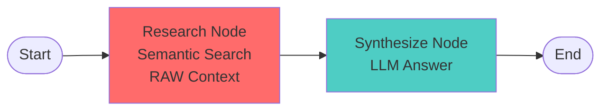

# Stage 1: Baseline RAG Agent (No Context Engineering)

## 🎯 Purpose

This is the **baseline** RAG agent that demonstrates what happens when you **don't** apply context engineering techniques. It's intentionally unoptimized to show students the problems that Section 2 techniques solve.

**Key Learning**: "Your retrieved data needs to be better engineered to be effective for retrieval."

## ⚠️ What's Wrong with This Agent?

This agent has several problems that will be fixed in Stage 2:

### 1. **Raw, Unoptimized Context**
- Returns complete JSON dumps of course objects
- Includes ALL fields (even irrelevant ones)
- No cleaning, no transformation, no optimization

### 2. **Noisy Data**
- Internal IDs (`id`, `created_at`, `updated_at`)
- Metadata fields (`enrollment_capacity`, `current_enrollment`)
- Redundant information

### 3. **Inefficient Token Usage**
- ~2,500-3,000 tokens for 5 courses
- Wastes tokens on noise
- Higher API costs

### 4. **Poor LLM Parsing**
- JSON is verbose and hard to parse
- LLMs prefer natural text
- Nested structures add complexity

## 🏗️ Architecture

### Simple 2-Node Workflow



### What It Does

1. **Research Node**:
   - Performs semantic search using Redis vector embeddings
   - Retrieves top 5 courses
   - Returns **RAW JSON dump** (no context engineering!)

2. **Synthesize Node**:
   - Sends raw context to LLM
   - Generates answer based on unoptimized data

### What It Doesn't Do

- ❌ No context cleaning (noise removal)
- ❌ No context transformation (JSON → natural text)
- ❌ No context optimization (token compression)
- ❌ No query decomposition
- ❌ No quality evaluation
- ❌ No iteration or refinement

## 📊 Example: The Problem

### Query
```
"What machine learning courses are available?"
```

### Raw Context Sent to LLM (2,847 tokens)

```json
[
  {
    "id": "course_abc123",
    "course_code": "CS002",
    "title": "Machine Learning",
    "description": "Introduction to machine learning algorithms and applications...",
    "department": "Computer Science",
    "major": "Computer Science",
    "credits": 4,
    "difficulty_level": "advanced",
    "format": "in_person",
    "instructor": "Lisa Dunlap",
    "prerequisites": [],
    "learning_objectives": [
      "Understand ML algorithms",
      "Implement classification and regression models",
      "Evaluate model performance",
      "Apply ML to real-world problems"
    ],
    "tags": ["machine learning", "AI", "data science"],
    "created_at": "2024-01-15T10:30:00Z",
    "updated_at": "2024-01-20T14:22:00Z",
    "enrollment_capacity": 50,
    "current_enrollment": 0,
    "semester": "Fall 2024",
    "year": 2024
  },
  {
    "id": "course_def456",
    ...
  }
]
```

### Problems Visible to Students

1. **Noise**: `id`, `created_at`, `updated_at`, `enrollment_capacity` are irrelevant
2. **Verbosity**: JSON structure adds overhead
3. **Token Waste**: ~570 tokens per course (could be ~300 with optimization)
4. **Poor Readability**: Hard for LLM to parse nested JSON

## 🚀 Usage

### Installation

```bash
cd python-recipes/context-engineering/reference-agent/progressive_agents/stage1_baseline_rag
```

### Environment Setup

Make sure you have the `.env` file in `reference-agent/` with:
```bash
OPENAI_API_KEY=your_key_here
REDIS_URL=redis://localhost:6379
```

### Running the Agent

**Interactive Mode**:
```bash
python cli.py
```

**Single Query**:
```bash
python cli.py "What machine learning courses are available?"
```

**Simulation Mode** (run example queries):
```bash
python cli.py --simulate
```

**With Cleanup** (remove courses on exit):
```bash
python cli.py --cleanup
```

## 📈 Expected Results

### Sample Output

```
❓ Question: What machine learning courses are available?

🔍 Searching for courses: 'What machine learning courses are available?'
✅ Found 5 courses
📊 Raw context: 11,388 chars (~2847 tokens)
⚠️  Using RAW context - no cleaning, no optimization!
🔬 Research complete in 245.32ms
🔗 Synthesizing answer from raw context...
🔗 Synthesis complete in 1523.45ms

============================================================
📝 Answer:
============================================================
Based on the course information provided, there are 2 machine learning 
courses available:

1. CS002: Machine Learning
   - Department: Computer Science
   - Credits: 4
   - Level: Advanced
   - Format: In-person
   - Instructor: Lisa Dunlap

2. CS009: Machine Learning
   - Department: Computer Science
   - Credits: 4
   - Level: Advanced
   - Format: Hybrid
   - Instructor: Katelyn Jones
   - Prerequisites: CS001

Both courses cover introduction to machine learning algorithms and 
applications, including supervised and unsupervised learning.

============================================================
📊 Metrics:
============================================================
   Courses Found: 5
   Estimated Tokens: ~2847

⚠️  This agent uses RAW context - no optimization!
   See Stage 2 for context engineering improvements
```

## 🔍 What Students Should Observe

### 1. Examine the Raw Context

Look at what's being sent to the LLM:
- How many tokens?
- What fields are unnecessary?
- Is the format LLM-friendly?

### 2. Identify Noise

Which fields don't help answer the question?
- `id` - internal identifier
- `created_at`, `updated_at` - timestamps
- `enrollment_capacity`, `current_enrollment` - enrollment data
- `semester`, `year` - scheduling info (unless asked)

### 3. Calculate Token Waste

```python
# Rough calculation
Total tokens: ~2,847
Courses: 5
Tokens per course: ~570

# How much is noise?
Noise fields per course: ~150-200 tokens
Potential savings: 26-35% just by removing noise!
```

### 4. Compare to Stage 2

After running Stage 1, students will:
1. Run the same query on Stage 2
2. See the context-engineered version
3. Compare token counts
4. Compare answer quality
5. Understand the value of context engineering

## 🎓 Learning Objectives

By using this baseline agent, students will:

1. **Understand the Problem**: See what happens without context engineering
2. **Identify Noise**: Learn to spot irrelevant data
3. **Measure Inefficiency**: Calculate token waste
4. **Motivate Solutions**: Understand why Section 2 techniques matter
5. **Prepare for Stage 2**: Know what to improve

## 📚 Course Data

### Auto-Loading

The agent automatically generates and loads ~50 sample courses on first run:
- 5 departments (CS, Math, Physics, Biology, English)
- 10 courses per department
- Realistic course data with descriptions, prerequisites, etc.

### Persistence

By default, courses persist in Redis between runs. Use `--cleanup` to remove them on exit.

### Manual Management

```python
from redis_context_course import CourseManager
from agent import load_courses_if_needed, cleanup_courses

# Load courses
course_manager = CourseManager()
await load_courses_if_needed(course_manager)

# Cleanup
await cleanup_courses(course_manager)
```

## 🔄 Next Steps

After understanding the problems with this baseline agent:

1. **Move to Stage 2**: See how context engineering fixes these issues
2. **Compare Results**: Run the same queries on both stages
3. **Measure Improvements**: Token reduction, better answers
4. **Learn Techniques**: Understand cleaning, transformation, optimization

## 🛠️ Technical Details

### Dependencies

- `langgraph` - Workflow orchestration
- `langchain-openai` - LLM integration
- `redis` - Vector storage
- `redisvl` - Redis vector library
- `nest_asyncio` - Async/sync compatibility

### State Definition

```python
class AgentState(TypedDict):
    query: str              # User's question
    raw_context: str        # Raw course data (JSON)
    courses_found: int      # Number of courses retrieved
    final_answer: str       # LLM's answer
    total_tokens: int       # Estimated token count
    total_time_ms: float    # Total execution time
```

### Workflow Nodes

1. **research_node**: Semantic search → raw JSON context
2. **synthesize_node**: LLM answer generation

## 📝 Notes for Instructors

### Teaching Points

1. **Show, Don't Tell**: Let students see the problems firsthand
2. **Measure Everything**: Token counts, costs, quality
3. **Compare Stages**: Side-by-side comparison is powerful
4. **Iterate**: Run multiple queries to see patterns

### Common Student Questions

**Q: "Why not just use the raw data? The LLM can handle it."**
A: Yes, but it's inefficient. You're paying for tokens you don't need. Plus, cleaner context = better answers.

**Q: "How much does this cost?"**
A: ~2,847 tokens × $0.01/1K tokens = $0.028 per query. Stage 2 reduces this by ~46%.

**Q: "Is JSON always bad?"**
A: No, but for LLMs, natural text is usually better. JSON adds structural overhead.

## 🔗 Related

- **Stage 2**: Context-Engineered Agent (applies Section 2 techniques)
- **Section 2 Notebooks**: Context engineering techniques
- **Comparison Tools**: Side-by-side stage comparison

---

**Remember**: This agent is intentionally unoptimized to demonstrate the problem. Stage 2 shows the solution!

