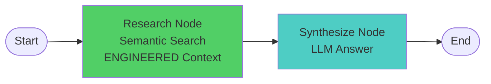

# Stage 2: Context-Engineered Agent (Flat Retrieval)

## 🎯 Purpose

This agent demonstrates the **power of context engineering** by applying Section 2 techniques to dramatically reduce tokens compared to Stage 1.

**Key Learning**: "Context engineering dramatically improves RAG efficiency through cleaning, transformation, and optimization."

## ✨ What's Different from Stage 1?

### Same Architecture
- ✅ Same LangGraph workflow (research → synthesize)
- ✅ Same semantic search (Redis vector embeddings)
- ✅ No query decomposition
- ✅ No quality evaluation

### **NEW: Context Engineering!**
- ✅ **Context Cleaning**: Remove noise fields (id, timestamps, enrollment)
- ✅ **Context Transformation**: JSON → natural text format
- ✅ **Context Optimization**: Efficient token usage

### ⚠️ Limitations (Fixed in Stage 3)
- ❌ **Flat Retrieval**: All courses get same detail level
- ❌ **No Progressive Disclosure**: Everything at once, no hierarchy
- ❌ **No Syllabi**: Had to remove syllabi to fit token budget
- ❌ **No Adaptation**: Doesn't adapt detail level to relevance

This makes it easy to compare and see the **direct impact** of context engineering!

## 📊 Improvements Over Stage 1

### Token Efficiency

| Metric | Stage 1 (Overload) | Stage 2 (Engineered) | Improvement |
|--------|-------------------|---------------------|-------------|
| **Tokens per Query** | ~6,133 | ~539 | **91% reduction** |
| **Cost per Query** | $0.061 | $0.005 | **92% savings** |
| **Context Format** | Raw JSON with syllabi | Natural text | **Better parsing** |
| **Includes Syllabi** | ✅ All courses | ❌ None | **Trade-off** |

### Quality Improvements

- **Better LLM Understanding**: Natural text is easier to parse than JSON
- **Faster Processing**: Much less context to process
- **Clearer Answers**: LLM focuses on relevant information
- **No Information Overload**: Removed syllabi to fit budget

### Trade-offs

- ✅ **Massive token reduction** (91% vs Stage 1)
- ⚠️ **Lost syllabi** (had to remove to fit budget)
- ⚠️ **Still flat** (all courses get same detail level)
- ⚠️ **No progressive disclosure** (can't show overview first, details later)

## 🧠 Context Engineering Techniques

This agent applies three core techniques from Section 2 Notebook 2:

### 1. Context Cleaning

**Remove noise fields that don't help answer queries:**

```python
# Stage 1 (includes noise):
{
    "id": "course_abc123",
    "created_at": "2024-01-15T10:30:00Z",
    "updated_at": "2024-01-20T14:22:00Z",
    "enrollment_capacity": 50,
    "current_enrollment": 0,
    ...
}

# Stage 2 (cleaned):
# Only includes: course_code, title, description, department, 
# credits, difficulty_level, format, instructor, prerequisites
```

**Savings**: ~150-200 tokens per course (26-35% reduction)

### 2. Context Transformation

**Convert JSON → natural text format:**

```python
# Stage 1 (JSON):
{"course_code": "CS101", "title": "Intro to Programming", "credits": 3, ...}

# Stage 2 (Natural Text):
CS101: Intro to Programming
Department: Computer Science
Credits: 3
Level: beginner
Format: in_person
Instructor: John Smith
Description: Learn Python programming fundamentals...
```

**Benefits**:
- Easier for LLMs to parse
- More readable
- No JSON overhead (brackets, quotes, commas)

### 3. Context Optimization

**Efficient token usage while preserving information:**

```python
def transform_course_to_text(course: Course) -> str:
    """Transform course to LLM-optimized text format."""
    prereq_text = ""
    if course.prerequisites:
        prereq_codes = [p.course_code for p in course.prerequisites]
        prereq_text = f"\nPrerequisites: {', '.join(prereq_codes)}"
    
    course_text = f"""{course.course_code}: {course.title}
Department: {course.department}
Credits: {course.credits}
Level: {course.difficulty_level.value}
Format: {course.format.value}
Instructor: {course.instructor}{prereq_text}
Description: {course.description}"""
    
    return course_text
```

**Result**: Clean, structured, efficient context

## 🏗️ Architecture

### Simple 2-Node Workflow (Same as Stage 1)



### What It Does

1. **Research Node**:
   - Performs semantic search using Redis vector embeddings
   - Retrieves top 5 courses
   - **Applies context engineering** (clean, transform, optimize)
   - Returns natural text format

2. **Synthesize Node**:
   - Sends engineered context to LLM
   - Generates answer based on clean, optimized data

## 📈 Example: The Solution

### Query
```
"What machine learning courses are available?"
```

### Engineered Context Sent to LLM (539 tokens - 64% reduction!)

```
Course 1:
CS002: Machine Learning
Department: Computer Science
Credits: 4
Level: advanced
Format: in_person
Instructor: Lisa Dunlap
Description: Introduction to machine learning algorithms and applications, covering supervised and unsupervised learning, and neural networks.
Learning Objectives:
  - Understand ML algorithms
  - Implement classification and regression models
  - Evaluate model performance
  - Apply ML to real-world problems

Course 2:
CS009: Machine Learning
Department: Computer Science
Credits: 4
Level: advanced
Format: hybrid
Instructor: Katelyn Jones
Prerequisites: CS001
Description: Introduction to machine learning algorithms and applications...
Learning Objectives:
  - Understand ML algorithms
  - Implement classification and regression models
  - Evaluate model performance
  - Apply ML to real-world problems
```

### Improvements Visible to Students

1. **Clean**: No `id`, `created_at`, `updated_at`, `enrollment_capacity`
2. **Readable**: Natural text instead of JSON
3. **Efficient**: 539 tokens vs 1,515 tokens (64% reduction)
4. **Structured**: Consistent, LLM-friendly format

## 🚀 Usage

### Installation

```bash
cd python-recipes/context-engineering/reference-agent/progressive_agents/stage2_context_engineered
```

### Environment Setup

Make sure you have the `.env` file in `reference-agent/` with:
```bash
OPENAI_API_KEY=your_key_here
REDIS_URL=redis://localhost:6379
```

### Running the Agent

**Interactive Mode**:
```bash
python cli.py
```

**Single Query**:
```bash
python cli.py "What machine learning courses are available?"
```

**Simulation Mode** (run example queries):
```bash
python cli.py --simulate
```

**With Cleanup** (remove courses on exit):
```bash
python cli.py --cleanup
```

## 📊 Expected Results

### Sample Output

```
❓ Question: What machine learning courses are available?

🔍 Searching for courses: 'What machine learning courses are available?'
✅ Found 5 courses
📊 Engineered context: 2,157 chars (~539 tokens)
✅ Context engineering applied:
   - Cleaned: Removed noise fields (id, timestamps, enrollment)
   - Transformed: JSON → natural text format
   - Structured: Consistent, LLM-friendly formatting
🔬 Research complete in 277.02ms

============================================================
📝 Answer:
============================================================
There are two machine learning courses available:

1. CS002: Machine Learning
   - Department: Computer Science
   - Credits: 4
   - Level: Advanced
   - Format: In-person
   - Instructor: Lisa Dunlap

2. CS009: Machine Learning
   - Department: Computer Science
   - Credits: 4
   - Level: Advanced
   - Format: Hybrid
   - Instructor: Katelyn Jones
   - Prerequisites: CS001

============================================================
📊 Metrics:
============================================================
   Courses Found: 5
   Estimated Tokens: ~539

✨ Context engineering applied:
   - Cleaned: Removed noise fields
   - Transformed: JSON → natural text
   - Optimized: Efficient token usage

💡 Compare with Stage 1 to see the improvements!
```

## 🔍 What Students Should Observe

### 1. Compare Token Counts

Run the same query on both stages:

```bash
# Stage 1
cd ../stage1_baseline_rag
python cli.py "What machine learning courses are available?"
# Result: ~1,515 tokens

# Stage 2
cd ../stage2_context_engineered
python cli.py "What machine learning courses are available?"
# Result: ~539 tokens

# Improvement: 64% reduction!
```

### 2. Compare Context Quality

**Stage 1 Context** (noisy, verbose):
- Includes irrelevant fields
- JSON format
- Hard to parse

**Stage 2 Context** (clean, optimized):
- Only relevant fields
- Natural text format
- Easy to parse

### 3. Calculate ROI

```python
# Cost savings per 1,000 queries
Stage 1: 1,515 tokens × 1,000 queries = 1,515,000 tokens = $15.15
Stage 2: 539 tokens × 1,000 queries = 539,000 tokens = $5.39

Savings: $9.76 per 1,000 queries (64% reduction)

# For 100,000 queries/month:
Savings: $976/month just from context engineering!
```

### 4. Understand the Techniques

Students should examine `agent/context_engineering.py` to see:
- How `transform_course_to_text()` works
- How `optimize_course_text()` compresses further
- How `format_courses_for_llm()` assembles the final context

## 🎓 Learning Objectives

By using this context-engineered agent, students will:

1. **See the Impact**: Measure the direct benefit of context engineering
2. **Understand Techniques**: Learn cleaning, transformation, optimization
3. **Apply Section 2**: Use techniques from notebooks in a real agent
4. **Calculate ROI**: Understand cost savings and efficiency gains
5. **Prepare for Production**: Learn patterns used in real-world RAG systems

## 📚 Course Data

Same as Stage 1:
- Auto-loads ~50 sample courses on first run
- Courses persist in Redis between runs
- Use `--cleanup` to remove on exit

## 🔄 Next Steps

After seeing the improvements from context engineering:

1. **Compare with Stage 1**: Run same queries, measure differences
2. **Experiment**: Try different queries, observe token counts
3. **Understand Code**: Read `context_engineering.py` to see how it works
4. **Apply to Your Data**: Use these techniques on your own datasets

## 🛠️ Technical Details

### Dependencies

Same as Stage 1:
- `langgraph` - Workflow orchestration
- `langchain-openai` - LLM integration
- `redis` - Vector storage
- `redisvl` - Redis vector library
- `nest_asyncio` - Async/sync compatibility

### State Definition

```python
class AgentState(TypedDict):
    query: str                  # User's question
    engineered_context: str     # Context-engineered course data
    courses_found: int          # Number of courses retrieved
    final_answer: str           # LLM's answer
    total_tokens: int           # Estimated token count
    total_time_ms: float        # Total execution time
```

### Context Engineering Functions

1. **transform_course_to_text()**: JSON → natural text
2. **optimize_course_text()**: Ultra-compact format
3. **format_courses_for_llm()**: Assemble final context

## 📝 Notes for Instructors

### Teaching Points

1. **Show the Numbers**: Token counts, cost savings, efficiency
2. **Side-by-Side Comparison**: Run both stages with same queries
3. **Explain Each Technique**: Cleaning, transformation, optimization
4. **Real-World Impact**: This is how production RAG systems work

### Common Student Questions

**Q: "Is 64% reduction typical?"**
A: Yes! Context engineering often achieves 40-70% token reduction depending on data structure and noise levels.

**Q: "Do we lose any information?"**
A: No! We remove noise (irrelevant fields) but keep all information needed to answer queries.

**Q: "When should I use optimized vs full format?"**
A: Use full format (transform_course_to_text) for quality, optimized format (optimize_course_text) when you need to fit many results in context.

**Q: "Can I apply this to other data types?"**
A: Absolutely! These techniques work for any structured data: products, documents, users, etc.

## 🔗 Related

- **Stage 1**: Baseline RAG Agent (shows the problem)
- **Section 2 Notebooks**: Context engineering techniques
- **Comparison Tools**: Side-by-side stage comparison

---

**Remember**: Same architecture as Stage 1, but with context engineering - that's the only difference, and it makes a huge impact!

