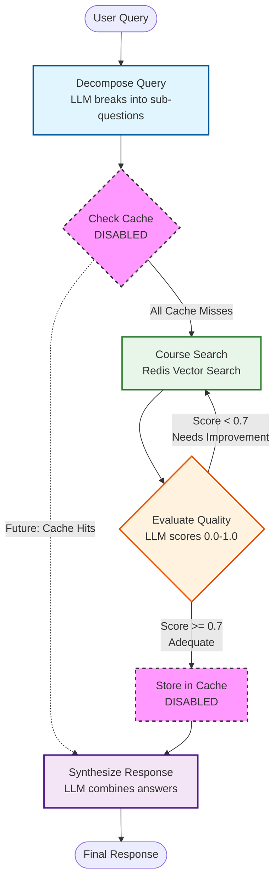

# Course Q&A Agent - Stage 3 (Full Agent without Memory)

A LangGraph-based intelligent agent for answering questions about courses using semantic search and context engineering techniques. This agent demonstrates advanced RAG patterns with query decomposition, quality evaluation, and iterative improvement.

**Stage 3** in the progressive learning path: Full-featured agent with optimized context engineering, but without memory integration (memory will be added in Stage 4).

## 🚀 Features

- **Intelligent Query Decomposition**: Breaks down complex course questions into focused sub-questions using LLM
- **Semantic Course Search**: Uses CourseManager with Redis vector search (RedisVL) for relevant course retrieval
- **Context Engineering**: Applies transformation and optimization techniques from Section 2 notebooks
- **Quality Assurance**: Evaluates and improves research quality through iterative loops
- **LangGraph Workflow**: Clean, observable agent architecture with explicit state management
- **Auto-loading Course Data**: Automatically generates and loads ~100 sample courses on first run
- **Persistent Storage**: Courses persist in Redis between runs (optional cleanup on exit)

## 🎯 How It Works

The agent follows a deep research workflow adapted for course Q&A:

1. **Query Decomposition**: Complex questions are broken into focused sub-questions using LLM
2. **Cache Check**: Each sub-question is checked against semantic cache (currently disabled for educational purposes)
3. **Course Search**: Semantic search using CourseManager with Redis vector embeddings (RedisVL)
4. **Quality Evaluation**: LLM evaluates search results for completeness and accuracy (0.0-1.0 score)
5. **Iterative Improvement**: Low-quality results (score < 0.7) trigger additional search rounds
6. **Response Synthesis**: All answers are combined into a comprehensive final response using LLM

### Workflow Diagram



**Legend**:
- 🔵 **Blue**: LLM-powered decomposition
- 🟢 **Green**: Redis vector search (RAG)
- 🟠 **Orange**: LLM-powered quality evaluation
- 🟣 **Purple**: LLM-powered synthesis
- 🩷 **Pink (dashed)**: Disabled features (semantic caching)

**Note**: Semantic caching is currently disabled for educational purposes. The agent demonstrates the full workflow without caching to show how RAG works at its core.

## 📁 Project Structure

```
stage3_full_agent_without_memory/
├── agent/                      # Core agent implementation
│   ├── __init__.py            # Package exports
│   ├── edges.py               # LangGraph routing logic
│   ├── nodes.py               # LangGraph workflow nodes
│   ├── setup.py               # Initialization logic
│   ├── state.py               # Agent state definitions
│   ├── tools.py               # Course search tools
│   └── workflow.py            # LangGraph workflow definition
├── cli.py                      # Interactive CLI
└── README.md                  # This file
```

## 🛠️ Setup

### Prerequisites

- Python 3.9+
- OpenAI API key
- Redis server (for course data)
- `redis-context-course` package installed

### Installation

From the `reference-agent` directory:

```bash
# Install the redis-context-course package
pip install -e .

# Set environment variables
export OPENAI_API_KEY="your-openai-api-key"
export REDIS_URL="redis://localhost:6379"
```

### Quick Start

**Interactive Mode** (recommended):
```bash
cd progressive_agents/stage3_full_agent_without_memory
python cli.py
```

**Single Query Mode**:
```bash
python cli.py "What machine learning courses are available for beginners?"
```

**Simulation Mode** (run example queries):
```bash
python cli.py --simulate
```

**Course Data Management**:
- On first run, the CLI automatically generates and loads ~50 sample courses into Redis
- Courses persist in Redis between runs (no need to reload each time)
- Use `--cleanup` flag to remove courses from Redis on exit:
  ```bash
  python cli.py --cleanup --simulate
  ```
- Debug course search with the debug script:
  ```bash
  python debug_search.py
  ```

**Programmatic Usage**:
```python
import asyncio
from agent import setup_agent, create_workflow, run_agent

async def main():
    # Initialize the agent
    course_manager, _ = await setup_agent()

    # Create the workflow
    agent = create_workflow(course_manager)

    # Run a query
    result = run_agent(
        agent,
        "What machine learning courses are available for beginners?"
    )

    # Print the response
    print(result["final_response"])

if __name__ == "__main__":
    asyncio.run(main())
```

## 🧠 Context Engineering Techniques

This agent applies context engineering techniques from Section 2 notebooks:

### 1. Context Transformation (`transform_course_to_text`)

Converts structured course objects into LLM-friendly natural text format:

```python
# Before (JSON):
{"course_code": "CS101", "title": "Intro to Programming", ...}

# After (Natural Text):
CS101: Intro to Programming
Department: Computer Science
Credits: 3
Level: beginner
...
```

**Benefits**: Easier for LLMs to parse, more natural language processing

### 2. Context Optimization (`optimize_course_text`)

Creates ultra-compact course descriptions for token efficiency:

```python
# Optimized format:
CS101: Intro to Programming - Fundamental programming concepts using Python... (Prereq: None)
```

**Benefits**: Reduced token count, faster processing, lower costs

### 3. Semantic Search

Uses Redis vector search (RedisVL) to find relevant courses based on semantic similarity:

```python
results = await course_manager.search_courses(
    query="machine learning courses",
    limit=5,
    similarity_threshold=0.5  # Lowered for better recall
)
```

**Implementation Note**: The agent uses a simplified direct search approach instead of a ReAct agent to avoid recursion issues. The `search_courses_sync` function wraps the async CourseManager search with `nest_asyncio` to handle nested event loops in LangGraph.

**Benefits**: Finds relevant courses even with different wording

## 📊 Performance Metrics

The agent tracks detailed performance metrics:

- **Total Latency**: End-to-end query processing time
- **Decomposition Latency**: Time to break down query
- **Cache Latency**: Time to check cache (currently minimal)
- **Research Latency**: Time for course search
- **Synthesis Latency**: Time to combine answers
- **Cache Hit Rate**: Percentage of cached answers (currently 0%)
- **LLM Calls**: Number of LLM API calls made

Access metrics from the result:

```python
result = run_agent(agent, query)
print(f"Total time: {result['metrics']['total_latency']:.2f}ms")
print(f"Execution path: {result['metrics']['execution_path']}")
```

## 🔄 Progressive Learning Path

This is **Stage 3** of the progressive learning experience:

- **Stage 1** (Future): Baseline RAG - Naive retrieval with raw JSON context
- **Stage 2** (Future): Context-Engineered RAG - Apply Section 2 techniques
- **Stage 3** (Current): Full Agent without Memory - Complete workflow with quality evaluation
- **Stage 4** (Future): Memory-Augmented Agent - Add Redis Agent Memory Server

## 🎓 Educational Goals

Students learn:

1. **LangGraph Architecture**: How to build observable, stateful agents
2. **Query Decomposition**: Breaking complex questions into manageable parts
3. **Context Engineering**: Transforming data for optimal LLM consumption
4. **Quality Evaluation**: Iterative improvement through self-assessment
5. **Semantic Search**: Vector-based retrieval for relevant information

## 🔧 Implementation Details

### Simplified Architecture

This agent uses a **simplified direct search approach** instead of the original ReAct agent pattern:

**Original (caching-agent)**:
- Used `create_react_agent` with tool calling
- Agent autonomously decided when to call search tools
- Hit LangGraph recursion limits (25 iterations)

**Simplified (this implementation)**:
- Direct call to `search_courses_sync` function
- No ReAct agent loop - just semantic search
- Avoids recursion issues while maintaining functionality

**Why the change?**:
- Educational clarity: Students see exactly what's happening
- Reliability: No recursion limit errors
- Performance: Fewer LLM calls, faster execution
- Simplicity: Easier to understand and debug

### Async/Sync Handling

The agent handles async/sync compatibility using `nest_asyncio`:

```python
def search_courses_sync(query: str, top_k: int = 5) -> str:
    """Synchronous wrapper for async search_courses."""
    import asyncio
    import nest_asyncio

    nest_asyncio.apply()  # Allow nested event loops
    loop = asyncio.get_event_loop()
    return loop.run_until_complete(course_manager.search_courses(...))
```

This allows the async CourseManager to work within LangGraph's synchronous node functions.

## 🚧 What's Commented Out (For Future Stages)

### Semantic Caching

Currently disabled to focus on core RAG workflow. Will be added in future stages:

```python
# In nodes.py - check_cache_node
# semantic_cache.check(question, num_results=1)

# In nodes.py - synthesize_response_node  
# semantic_cache.store(question, answer)
```

### Why Disabled?

- Focus on understanding the core workflow first
- Semantic caching adds complexity (similarity thresholds, false positives)
- Will be introduced progressively with proper tuning and monitoring

## 🧪 Testing

Run the CLI in simulation mode to test with example queries:

```bash
cd progressive_agents/stage3_full_agent_without_memory
python cli.py --simulate
```

Or test interactively:

```bash
python cli.py
```

## 📚 Related Resources

- **Section 2 Notebooks**: Context engineering techniques
- **CourseManager**: Redis-based course search (`redis_context_course.course_manager`)
- **LangGraph Docs**: https://langchain-ai.github.io/langgraph/
- **Original Caching Agent**: `/Users/nitin.kanukolanu/workspace/caching-agent`

## 🤝 Contributing

This is part of the Redis University context engineering course. Improvements and extensions are welcome!

## 📄 License

MIT License - See LICENSE file for details

