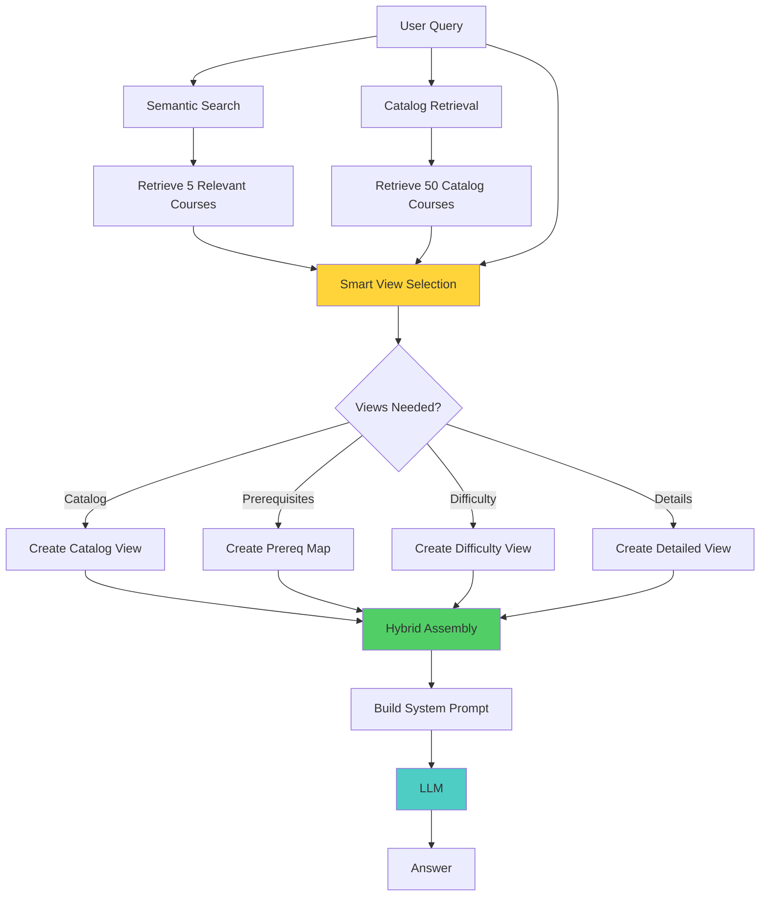

# Stage 3: Hybrid RAG Agent

Production-ready RAG implementation with advanced context engineering patterns.

## Overview

This stage demonstrates **hybrid context assembly** - combining multiple context views for optimal results:
- ✅ Structured catalog views (hierarchical organization)
- ✅ Hybrid assembly (overview + details)
- ✅ Query-aware optimization (smart view selection)
- ✅ Multi-strategy retrieval (semantic + metadata)
- ✅ ~70% token reduction vs Stage 1 (2,500 → 800)
- ✅ Scalable to large catalogs

**Educational Purpose:** Students learn production-ready patterns that combine multiple context engineering techniques for optimal token efficiency and answer quality.

## Architecture

### Flow Diagram



**Hybrid flow with multi-strategy retrieval:**
```
User Query → Semantic Search (details) + Catalog Retrieval (overview)
          → Smart View Selection → Hybrid Assembly → LLM → Answer
```

**Key Innovations:**
- **Catalog View:** High-level overview of all courses (20 tokens/course)
- **Detailed View:** Full information for relevant courses (400 tokens/course)
- **Smart Selection:** Auto-select views based on query keywords
- **Hybrid Assembly:** Combine multiple views intelligently

## Files

- **`agent.py`** - HybridRAGAgent implementation
- **`structured_views.py`** - Catalog views and hybrid assembly utilities
- **`cli.py`** - Interactive command-line interface
- **`notebook.ipynb`** - Educational notebook with hybrid patterns
- **`README.md`** - This file

## Quick Start

### Using the Notebook (Recommended for Learning)

```bash
cd progressive_agents/stage3_hybrid
jupyter notebook notebook.ipynb
```

The notebook provides:
- Structured view examples
- Hybrid assembly demonstrations
- Smart view selection explained
- Complete 3-stage comparison

### Using the CLI (Recommended for Testing)

```bash
cd progressive_agents/stage3_hybrid
python cli.py
```

**Example interactions:**

**1. Catalog view (triggered by "available"):**
```
You: What courses are available?

Agent: Redis University offers courses across several departments:

## Computer Science (15 courses)
- CS-101: Introduction to Programming (beginner)
- CS-201: Data Structures (intermediate)
- CS-401: Machine Learning Fundamentals (intermediate)
...

## Data Engineering (8 courses)
- DE-301: Database Systems (intermediate)
...
```

**2. Detailed view (specific query):**
```
You: Tell me about machine learning courses

Agent: Here are the machine learning courses:

CS-401: Machine Learning Fundamentals
Department: Computer Science
Credits: 3
Level: intermediate
Description: Introduction to supervised learning, neural networks...
```

**3. Prerequisites view (triggered by "prerequisites"):**
```
You: What are the prerequisites for advanced ML?

Agent: For CS-501 (Advanced Machine Learning), you need:
- CS-401: Machine Learning Fundamentals (minimum grade: B)
- CS-301: Linear Algebra (minimum grade: C)
```

**Check metrics:**
```
You: metrics

📊 Metrics:
• Token count: 847
• Format: hybrid
• Views included: include_catalog
• Est. cost per 1K queries: $2.00
✅ ~70% fewer tokens than Stage 1!
```

**Compare all stages:**
```
You: compare

All Stages Comparison:
┌──────────────────────┬──────────────┬────────┬──────────┬────────────┐
│ Stage                │ Format       │ Tokens │ Cost/1K  │ vs Stage 1 │
├──────────────────────┼──────────────┼────────┼──────────┼────────────┤
│ Stage 1 (Baseline)   │ Raw JSON     │ 2,487  │ $6.25    │ —          │
│ Stage 2 (Optimized)  │ Natural Text │ 1,247  │ $3.00    │ -49.9%     │
│ Stage 3 (Hybrid)     │ Hybrid Views │ 847    │ $2.00    │ -65.9%     │
└──────────────────────┴──────────────┴────────┴──────────┴────────────┘
```

### Using the Python API

```python
import asyncio
from progressive_agents.stage3_hybrid.agent import HybridRAGAgent

async def main():
    agent = HybridRAGAgent()
    
    # Ask a question
    response = await agent.chat("What courses are available?")
    print(response)
    
    # Get metrics
    metrics = await agent.get_metrics("What courses are available?")
    print(f"Tokens: {metrics['token_count']:,}")
    print(f"Views: {metrics['views_included']}")
    
    # Compare all stages
    comparison = await agent.compare_all_stages("machine learning")
    print(f"Stage 1: {comparison['stage1']['tokens']:,} tokens")
    print(f"Stage 3: {comparison['stage3']['tokens']:,} tokens")
    print(f"Reduction: {comparison['stage3']['vs_stage1']}")

asyncio.run(main())
```

## Hybrid Context Patterns

### 1. Catalog View (Overview)

**When to use:** Broad queries like "What courses are available?"

**Format:**
```
# Redis University Course Catalog

## Computer Science (15 courses)
- CS-101: Introduction to Programming (beginner)
- CS-201: Data Structures (intermediate)
- CS-401: Machine Learning Fundamentals (intermediate)
...

## Data Engineering (8 courses)
- DE-301: Database Systems (intermediate)
...
```

**Token usage:** ~20 tokens per course (vs 500 for full details)

### 2. Detailed View

**When to use:** Specific queries about particular courses

**Format:** Natural text (from Stage 2)

**Token usage:** ~400 tokens per course

### 3. Prerequisite Map

**When to use:** Queries about "prerequisites", "required", "sequence"

**Format:**
```
# Course Prerequisites
- CS-501: Requires CS-401, CS-301
- CS-401: No prerequisites (foundational)
```

### 4. Difficulty Progression

**When to use:** Queries about "beginner", "advanced", "difficulty"

**Format:**
```
# Course Difficulty Progression

## Beginner (5 courses)
- CS-101: Introduction to Programming
...

## Intermediate (8 courses)
- CS-401: Machine Learning Fundamentals
...
```

## Smart View Selection

The agent automatically selects views based on query keywords:

| Query Keywords | Views Included |
|---------------|----------------|
| "available", "what courses", "list" | Catalog view |
| "prerequisite", "required", "before" | Prerequisite map |
| "beginner", "advanced", "difficulty" | Difficulty progression |
| Specific course names | Details only |

**Disable smart selection:**
```bash
python cli.py --no-smart-selection
```

## Metrics Comparison

| Metric | Stage 1 | Stage 2 | Stage 3 |
|--------|---------|---------|---------|
| Token count (5 courses) | ~2,500 | ~1,200 | ~800 |
| Cost per 1K queries | $6.25 | $3.00 | $2.00 |
| Format | Raw JSON | Natural text | Hybrid views |
| Scalability | Poor | Good | Excellent |
| Context organization | Flat | Flat | Hierarchical |

## Learning Objectives

After completing Stage 3, students should understand:

1. ✅ **Structured views** - Organize context hierarchically
2. ✅ **Hybrid assembly** - Combine overview + details
3. ✅ **Query-aware optimization** - Select views based on query
4. ✅ **Multi-strategy retrieval** - Semantic + catalog
5. ✅ **Production patterns** - Scalable, maintainable, efficient

## When to Use Hybrid RAG

### Use Hybrid (Stage 3) when:
- ✅ Large catalog (50+ items)
- ✅ Diverse query types (browsing + specific)
- ✅ Need scalability
- ✅ Production deployment

### Use Optimized (Stage 2) when:
- ✅ Small catalog (<50 items)
- ✅ Specific queries only
- ✅ Simpler requirements

### Use Baseline (Stage 1) when:
- ✅ Prototyping
- ✅ Debugging
- ⚠️ Not recommended for production

## Advanced Patterns

### Custom View Selection

```python
from progressive_agents.stage3_hybrid.structured_views import hybrid_context_assembly

# Manual view selection
context = hybrid_context_assembly(
    query=query,
    all_courses=catalog_courses,
    relevant_courses=relevant_courses,
    include_catalog=True,
    include_prerequisites=True,
    include_difficulty=False
)
```

### Caching Catalog View

The agent automatically caches the catalog view to avoid repeated retrieval:

```python
# First call: retrieves and caches
catalog = await agent.retrieve_catalog_courses()

# Subsequent calls: uses cache
catalog = await agent.retrieve_catalog_courses()  # Fast!
```

## Educational Notes

### Key Insights

1. **Hybrid > Single Strategy**
   - Overview gives context
   - Details provide specifics
   - Together: best of both worlds

2. **Query-Aware Optimization**
   - Different queries need different views
   - Smart selection improves relevance
   - Reduces unnecessary context

3. **Scalability Matters**
   - Catalog view scales to 1000s of courses
   - Detailed view stays focused (top 5)
   - Total tokens stay manageable

### Common Student Questions

**Q: Why not just show all details?**
A: For 50 courses × 500 tokens = 25,000 tokens! Catalog view gives overview with 50 × 20 = 1,000 tokens.

**Q: How does smart selection work?**
A: Keyword matching on query. "What courses are available?" → includes catalog. "Tell me about ML" → details only.

**Q: Can I customize view selection?**
A: Yes! Either modify `smart_context_selection()` or pass views manually to `hybrid_context_assembly()`.

**Q: What if I have 10,000 courses?**
A: Catalog view still works! Show top 10 per department, or add pagination/filtering.

## Next Steps

**Add Memory (Future Stage 4):**
- Working memory (conversation history)
- Long-term memory (user preferences)
- Memory-aware context selection

See Section 3 notebooks for memory integration patterns.

## References

- **Section 2 Notebooks:** Context transformation techniques
- **`structured_views.py`:** Implementation of all view patterns
- **Stage 1:** Baseline for comparison
- **Stage 2:** Context optimization foundation

