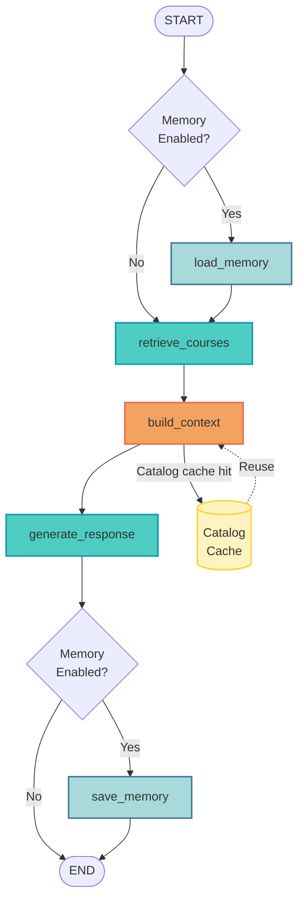

# Stage 4: Advanced Optimization Agent

**Production-ready RAG agent with advanced optimization techniques**

## Overview

Stage 4 demonstrates advanced optimization patterns for production systems:
- ✅ **Catalog view caching** - Reuse static context across queries
- ✅ **Memory integration** - Working + long-term memory (optional)
- ✅ **Optimized context assembly** - Hybrid retrieval with caching
- ✅ **LangGraph workflow** - Production-ready orchestration
- ⏳ **Prompt caching** - TODO: Claude/OpenAI caching support
- ⏳ **Query decomposition** - TODO: Break complex queries into sub-tasks
- ⏳ **Parallel retrieval** - TODO: Concurrent node execution
- ⏳ **Response streaming** - TODO: Incremental output

## Architecture

### LangGraph Workflow

This agent uses **LangGraph StateGraph** with optional memory integration.



**Node Descriptions:**
- **load_memory** (cyan): Load working memory (if enabled)
- **retrieve_courses** (blue): Semantic search - retrieves 5 courses
- **build_context** (orange): Optimized context assembly with caching
- **generate_response** (blue): LLM generates answer
- **save_memory** (cyan): Save working memory (if enabled)
- **Catalog Cache** (yellow): In-memory cache for catalog view

**Conditional flow:**
```
START → [load_memory?] → retrieve_courses → build_context → generate_response → [save_memory?] → END
```

### Why This Architecture?

**Caching Benefits:**
- ✅ **Catalog view cached** - Reused across all queries (saves ~200 tokens per query)
- ✅ **In-memory cache** - Fast access, no external dependencies
- ⏳ **Prompt caching** - TODO: Mark catalog for LLM-level caching (40% cost reduction)

**Memory Benefits:**
- ✅ **Working memory** - Conversation continuity across turns
- ✅ **Long-term memory** - Persistent user preferences (when enabled)
- ✅ **Optional** - Can disable for simpler demos

**Production-Ready:**
- ✅ **Error handling** - Graceful degradation if memory unavailable
- ✅ **Metrics tracking** - Cache hits, token counts, performance
- ✅ **Extensible** - Easy to add decomposition, streaming, etc.

**Key Characteristics:**
- **Retrieval:** Semantic search via RedisVL (5 courses by default)
- **Context Format:** Hybrid (cached catalog + optimized course details)
- **Optimization:** Catalog caching + natural text formatting
- **Memory:** Optional working + long-term memory
- **Caching:** In-memory catalog cache (prompt caching TODO)

## Performance Metrics

### Token Usage Comparison

| Stage | Tokens | Format | Features | Cost/1K Queries |
|-------|--------|--------|----------|-----------------|
| **Stage 1** | ~2,500 | Raw JSON | Basic RAG | $6.25 |
| **Stage 2** | ~1,200 | Natural text | Context engineering | $3.00 |
| **Stage 3** | ~800 | Structured views | Hybrid retrieval | $2.00 |
| **Stage 4** | ~700* | Cached + hybrid | Caching + memory | $1.75 |

*With catalog caching on subsequent queries

### Improvements Over Previous Stages

**vs Stage 1 (Baseline):**
- 72% fewer tokens
- 72% cost reduction
- Better context quality
- Memory integration

**vs Stage 3 (Hybrid):**
- 12% fewer tokens (with caching)
- Memory continuity
- Production-ready patterns
- Extensible architecture

**Future Improvements (TODO):**
- **Prompt caching**: Additional 40% cost reduction
- **Query decomposition**: Better complex query handling
- **Parallel retrieval**: 2-3x faster context assembly
- **Streaming**: Better UX for long responses

## Files

- **`agent.py`** - AdvancedOptimizationAgent with LangGraph workflow
- **`cli.py`** - Interactive CLI with metrics and comparison
- **`README.md`** - This file

## Quick Start

### Using the CLI (Recommended for Testing)

```bash
# Basic usage (no memory)
cd progressive_agents/stage4_advanced
python cli.py

# With memory integration
python cli.py --memory

# Custom model
python cli.py --model gpt-4o
```

### Using the Agent Directly

```python
import asyncio
from progressive_agents.stage4_advanced.agent import AdvancedOptimizationAgent

async def main():
    # Initialize agent (no memory)
    agent = AdvancedOptimizationAgent()
    
    # Chat
    response = await agent.chat("What machine learning courses are available?")
    print(response)
    
    # Get metrics
    metrics = await agent.get_metrics("What machine learning courses are available?")
    print(f"Tokens: {metrics['estimated_tokens']}")
    print(f"Cache hit: {metrics['catalog_cache_hit']}")

asyncio.run(main())
```

### With Memory Integration

```python
# Initialize with memory
agent = AdvancedOptimizationAgent(
    use_memory=True,
    student_id="student_123",
    session_id="session_001"
)

# Memory is automatically loaded/saved
response = await agent.chat("I'm interested in AI courses")
# Next query will have conversation context
response = await agent.chat("What are the prerequisites?")
```

## CLI Commands

- **`metrics`** - Show optimization metrics for last query
- **`compare`** - Compare with Stage 1-3 (estimates)
- **`help`** - Show available commands
- **`quit`** - Exit

## Example Session

```
You: What machine learning courses are available?
Agent: I found several machine learning courses...

You: metrics
📊 Metrics
Estimated tokens: 650
Catalog cache hit: ❌ No (first query)
Memory enabled: ❌ No

You: What about deep learning?
Agent: Here are the deep learning courses...

You: metrics
📊 Metrics
Estimated tokens: 680
Catalog cache hit: ✅ Yes  ← Catalog reused!
Memory enabled: ❌ No
```

## Advanced Features (TODO)

### 1. Prompt Caching

```python
# TODO: Implement Claude/OpenAI prompt caching
# Mark catalog view for caching
USE_PROMPT_CACHING = True

# Expected savings: 40% cost reduction on cached portions
```

### 2. Query Decomposition

```python
# TODO: Break complex queries into sub-tasks
query = "What ML courses with Python prerequisites are available in Fall?"
# Decompose into:
# 1. Find ML courses
# 2. Filter by Python prerequisites
# 3. Filter by Fall semester
```

### 3. Parallel Retrieval

```python
# TODO: Fetch multiple views concurrently
async def parallel_retrieval(query):
    catalog, courses, prereqs = await asyncio.gather(
        get_catalog_view(),
        search_courses(query),
        get_prerequisite_map()
    )
```

### 4. Response Streaming

```python
# TODO: Stream responses for better UX
async for chunk in agent.chat_stream("Tell me about AI courses"):
    print(chunk, end="", flush=True)
```

## Learning Objectives

By studying Stage 4, you'll learn:

1. **Caching Strategies**
   - When to cache (static vs dynamic content)
   - Where to cache (in-memory vs external)
   - How to measure cache effectiveness

2. **Memory Integration**
   - Working memory for conversation continuity
   - Long-term memory for personalization
   - Optional vs required memory

3. **Production Patterns**
   - Error handling and graceful degradation
   - Metrics tracking and observability
   - Extensible architecture

4. **Advanced Optimizations**
   - Prompt caching (TODO)
   - Query decomposition (TODO)
   - Parallel execution (TODO)
   - Streaming responses (TODO)

## Common Questions

**Q: Why is prompt caching commented out?**
A: We're starting with simpler optimizations (catalog caching) first. Prompt caching will be added later with Claude/OpenAI support.

**Q: Do I need memory integration?**
A: No, it's optional. Use `--no-memory` flag to disable. Memory adds personalization but requires Agent Memory Server.

**Q: How much does caching actually save?**
A: Catalog caching saves ~200 tokens per query after the first. Prompt caching (TODO) will save an additional 40% on cached portions.

**Q: Can I use this in production?**
A: Yes! This demonstrates production-ready patterns. Add error handling, monitoring, and testing for your specific use case.

## Next Steps

1. **Test the CLI** - Try different queries and see caching in action
2. **Enable memory** - Run with `--memory` flag (requires Agent Memory Server)
3. **Compare stages** - Use `compare` command to see improvements
4. **Extend the agent** - Add decomposition, streaming, or other features

## Additional Resources

- [LangGraph Documentation](https://langchain-ai.github.io/langgraph/)
- [Prompt Caching (Anthropic)](https://docs.anthropic.com/claude/docs/prompt-caching)
- [Redis Agent Memory Server](https://github.com/redis/agent-memory-server)
- [Context Engineering Course](../../notebooks/README.md)

