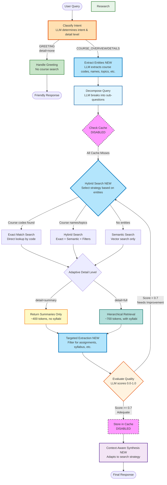

# Stage 4: Hybrid Search with Named Entity Recognition (NER)

A LangGraph-based intelligent agent demonstrating **hybrid search**, **Named Entity Recognition (NER)**, and **context-aware extraction** patterns. This agent combines exact matching, semantic search, and metadata filtering for precise, efficient retrieval.

**Stage 4** in the progressive learning path: Advanced retrieval with NER, hybrid search strategies, and targeted information extraction.

## 🚀 Features

### **NEW: Hybrid Search with NER!**
- **Named Entity Recognition**: Extracts structured information from natural language queries
  - **Course Codes**: CS101, MATH202, etc. → Exact match lookup
  - **Course Names**: "Introduction to Python" → Text + semantic search
  - **Departments**: Computer Science, Mathematics → Metadata filtering
  - **Topics**: machine learning, databases → Enhanced semantic search
  - **Information Types**: assignments, syllabus, grading → Targeted extraction
- **Hybrid Search Strategies**:
  - **Exact Match**: Direct lookup for course codes (highest precision)
  - **Hybrid**: Combines exact + semantic + metadata filters
  - **Semantic Only**: Traditional vector search (fallback)
- **Context-Aware Extraction**: Uses conversation history to determine what to retrieve
- **Targeted Information Retrieval**: Returns only requested sections (assignments, syllabus, etc.)

### **Intent Classification & Adaptive Retrieval**
- **Query Intent Classification**: Automatically detects greeting, overview, or detail requests
- **Adaptive Detail Levels**: Matches retrieval depth to query intent
  - **Greetings**: No course search (~50 tokens)
  - **Overview queries**: Summaries only (~400 tokens)
  - **Detail requests**: Full syllabi (~700 tokens)
- **Smart Routing**: Skips unnecessary processing for simple queries
- **Token Efficiency**: 85-99% reduction for non-detail queries

### **Hierarchical Retrieval**
- **Two-Tier Retrieval**: Summaries for ALL courses, full details for top 2-3
- **Progressive Disclosure**: Overview first, details on-demand
- **Context Budget Management**: Strategic token allocation based on query intent
- **Includes Syllabi**: Full 14-week syllabi for top matches (when requested)
- **Summary-Only Mode**: Course overviews without syllabi for overview queries

### Advanced RAG Patterns
- **Intelligent Query Decomposition**: Breaks down complex questions into focused sub-questions
- **Semantic Course Search**: Redis vector search with hierarchical course data
- **Quality Assurance**: Evaluates and improves research quality through iterative loops
- **LangGraph Workflow**: Clean, observable agent architecture with explicit state management
- **Auto-loading Course Data**: Automatically loads 50 hierarchical courses with full syllabi
- **Persistent Storage**: Courses persist in Redis between runs (optional cleanup on exit)

## 🎯 How It Works

The agent follows an intelligent workflow with **NER**, **hybrid search**, and **adaptive retrieval**:

1. **Intent Classification**: LLM classifies query intent and determines detail level needed
   - **GREETING**: Social interactions → No course search
   - **COURSE_OVERVIEW**: "What courses exist?" → Summaries only
   - **COURSE_DETAILS**: "Show me syllabus" → Full details with syllabi
   - **GENERAL_QUESTION**: Other queries → Adaptive retrieval

2. **Smart Routing**: Based on intent classification
   - **Greetings** → Direct response, skip all course retrieval
   - **Course queries** → Continue to NER extraction

3. **Named Entity Recognition (NEW in Stage 4)**: LLM extracts structured information
   - **Course codes**: CS101, MATH202 → Exact match strategy
   - **Course names**: "Machine Learning" → Hybrid search strategy
   - **Departments**: Computer Science → Metadata filters
   - **Topics**: databases, calculus → Enhanced semantic query
   - **Information types**: assignments, syllabus → Targeted extraction
   - **Metadata**: difficulty, format, semester → Search filters

4. **Query Decomposition**: Complex questions are broken into focused sub-questions using LLM

5. **Cache Check**: Each sub-question is checked against semantic cache (currently disabled for educational purposes)

6. **Hybrid Course Search (NEW in Stage 4)**:
   - **Exact Match Strategy** (course codes found):
     - Direct lookup by course code
     - Highest precision, lowest latency
     - Returns only requested courses
   - **Hybrid Strategy** (course names + topics):
     - Exact matches for any course codes
     - Semantic search enhanced with topics
     - Metadata filtering (department, difficulty, etc.)
     - Deduplication of results
   - **Semantic Only Strategy** (fallback):
     - Traditional vector search
     - Metadata filtering if available
   - **Adaptive Detail Level**:
     - **Summary Mode**: Summaries only (~400 tokens)
     - **Full Mode**: Summaries + details for top 2-3 (~700 tokens)
   - **Targeted Information Extraction**:
     - If assignments requested → Extract only assignments
     - If syllabus requested → Extract only syllabus
     - If grading requested → Extract only grading policy

7. **Quality Evaluation**: LLM evaluates search results for completeness and accuracy (0.0-1.0 score)

8. **Iterative Improvement**: Low-quality results (score < 0.7) trigger additional search rounds

9. **Context-Aware Synthesis (NEW in Stage 4)**: Response adapts to search strategy
   - **Exact matches**: Direct, concise answers for specific courses
   - **Hybrid results**: Prioritize exact matches, supplement with semantic
   - **Semantic results**: Comprehensive overview with multiple options
   - **Specific info requests**: Extract and present only requested information

### Workflow Diagram



**Legend**:
- 🟠 **Orange (thick)**: NEW! Intent classification
- 🟢 **Green**: Greeting handler (no retrieval)
- 🔵 **Blue**: LLM-powered decomposition
- 🟢 **Green**: Redis vector search (RAG)
- 🟡 **Yellow**: Summary-only retrieval
- 🟢 **Teal**: Hierarchical retrieval (full details)
- 🟠 **Orange**: LLM-powered quality evaluation
- 🟣 **Purple**: LLM-powered synthesis
- 🩷 **Pink (dashed)**: Disabled features (semantic caching)

**Note**: Semantic caching is currently disabled for educational purposes. The agent demonstrates the full workflow without caching to show how RAG works at its core.

## 📁 Project Structure

```
stage3_full_agent_without_memory/
├── agent/                      # Core agent implementation
│   ├── __init__.py            # Package exports
│   ├── edges.py               # LangGraph routing logic
│   ├── nodes.py               # LangGraph workflow nodes
│   ├── setup.py               # Initialization logic
│   ├── state.py               # Agent state definitions
│   ├── tools.py               # Course search tools
│   └── workflow.py            # LangGraph workflow definition
├── cli.py                      # Interactive CLI
└── README.md                  # This file
```

## 🛠️ Setup

### Prerequisites

- Python 3.9+
- OpenAI API key
- Redis server (for course data)
- `redis-context-course` package installed

### Installation

From the `reference-agent` directory:

```bash
# Install the redis-context-course package
pip install -e .

# Set environment variables
export OPENAI_API_KEY="your-openai-api-key"
export REDIS_URL="redis://localhost:6379"
```

### Quick Start

**Interactive Mode** (recommended):
```bash
cd progressive_agents/stage3_full_agent_without_memory
python cli.py
```

**Single Query Mode**:
```bash
python cli.py "What machine learning courses are available for beginners?"
```

**Simulation Mode** (run example queries):
```bash
python cli.py --simulate
```

**Help**:
```bash
python cli.py --help
```

**Course Data Management**:
- On first run, the CLI automatically loads 50 hierarchical courses with full syllabi
- Courses persist in Redis between runs (no need to reload each time)
- Use `--cleanup` flag to remove courses from Redis on exit:
  ```bash
  python cli.py --cleanup
  ```
- Hierarchical course data is loaded from `redis_context_course/data/hierarchical/hierarchical_courses.json`

**Programmatic Usage**:
```python
import asyncio
from agent import setup_agent, create_workflow, run_agent

async def main():
    # Initialize the agent
    course_manager, _ = await setup_agent()

    # Create the workflow
    agent = create_workflow(course_manager)

    # Run a query
    result = run_agent(
        agent,
        "What machine learning courses are available for beginners?"
    )

    # Print the response
    print(result["final_response"])

if __name__ == "__main__":
    asyncio.run(main())
```

## 📚 Example Queries

### Greeting (No Course Search)

```bash
$ python cli.py "hello"
```

**Response** (~50 tokens):
```
Hello! It's great to hear from you. I'm a course advisor agent here to help you
find courses, view syllabi, check prerequisites, and more. How can I assist you today?
```

**What happened**:
- Intent: GREETING, Detail Level: none
- Execution: greeting_handled
- Course search: ❌ Skipped
- Token efficiency: ✅ 99% reduction vs full search

---

### Course Overview (Summaries Only)

```bash
$ python cli.py "What machine learning courses are available?"
```

**Response** (~400 tokens):
```
Found 5 relevant courses:

1. CS002: Deep Learning and Neural Networks
   Department: Computer Science | Instructor: Abigail Shaffer
   Credits: 4 | Level: Graduate | Format: Hybrid
   Description: Advanced neural network architectures and deep learning techniques.
   Tags: deep learning, neural networks, transformers, computer vision

2. CS009: Computer Vision
   Department: Computer Science | Instructor: Sherry Decker
   Credits: 4 | Level: Advanced | Format: Online
   Description: Image processing, object detection, and visual recognition systems.
   Prerequisites: CS004
   Tags: computer vision, image processing, object detection, CNN

[... 3 more course summaries ...]
```

**What happened**:
- Intent: COURSE_OVERVIEW, Detail Level: summary
- Execution: decomposed → researched → synthesized
- Course search: ✅ Summary-only mode
- Syllabi included: ❌ No (summaries only)
- Token efficiency: ✅ 85% reduction vs full details

---

### Course Details (Full Syllabi)

```bash
$ python cli.py "Show me the syllabus for CS002"
```

**Response** (~3,900 tokens):
```
Found relevant courses:

## Overview of All Matches (5 courses)
[... summaries for all 5 courses ...]

## Detailed Information (Top 3 Courses)

---
## CS002: Deep Learning and Neural Networks

**Instructor**: Abigail Shaffer
**Schedule**: Monday, Wednesday, Friday, 04:00 PM - 04:50 PM
**Location**: Science Hall 540

### Description
Advanced neural network architectures and deep learning techniques...

### Learning Objectives
- Understand core concepts in deep learning...
[... full learning objectives ...]

### Grading Policy
- Homework: 40%
- Projects: 40%
- Participation: 20%

### Assignments (10 total, 1250 points)
[... complete assignment list ...]

### Course Syllabus (15 weeks)

**Week 1: Deep Learning Foundations**
Topics: Deep Learning Foundations - Part 1, Part 2, Part 3, Part 4
Readings: Chapter 1, Research Paper 1

**Week 2: Convolutional Neural Networks**
[... complete 15-week syllabus ...]

### Textbooks
[... required and recommended textbooks ...]

[... full details for 2 more courses ...]
```

**What happened**:
- Intent: COURSE_DETAILS, Detail Level: full
- Execution: decomposed → researched → synthesized
- Course search: ✅ Hierarchical mode
- Syllabi included: ✅ Yes (top 2-3 courses)
- Token efficiency: ✅ Appropriate for detail request

---

## 🧠 Context Engineering Techniques

This agent applies **advanced context engineering** from Section 2 notebooks:

### 1. Intent Classification & Adaptive Retrieval (NEW!)

**Match retrieval depth to query intent:**

```python
# Step 1: Classify intent
intent, detail_level = classify_query_intent(query)
# Returns: ("COURSE_OVERVIEW", "summary") or ("COURSE_DETAILS", "full")

# Step 2: Adaptive retrieval
if detail_level == "summary":
    # Return ONLY summaries (~400 tokens)
    context = assemble_summary_only_context(summaries)
elif detail_level == "full":
    # Return summaries + full details (~700 tokens)
    context = assemble_hierarchical_context(summaries, details)
else:  # detail_level == "none"
    # Skip course search entirely
    return handle_greeting(query)
```

**Benefits**:
- **Token efficiency**: 85-99% reduction for non-detail queries
- **Better UX**: Don't overwhelm users with unnecessary information
- **Cost savings**: Fewer tokens = lower API costs
- **Faster responses**: Skip unnecessary retrieval and processing

### 2. Hierarchical Retrieval

**Two-tier retrieval with progressive disclosure:**

```python
# TIER 1: Search summaries (lightweight)
summaries = search_summaries(query, limit=5)  # ~300 tokens

# TIER 2: Fetch details for top matches (comprehensive)
top_details = fetch_details(summaries[:3])  # ~400 tokens

# PROGRESSIVE DISCLOSURE: Combine both
context = assemble_hierarchical_context(
    summaries=summaries,      # All 5 courses (overview)
    details=top_details       # Top 2-3 courses (full syllabi)
)
# Total: ~700 tokens with BETTER information quality
```

**Benefits**:
- Overview of all options (broad awareness)
- Deep details for best matches (informed decisions)
- Efficient token usage (~700 vs ~6,000 in Stage 1)
- Includes syllabi for top matches (vs none in Stage 2)

### 2. Context Transformation

Converts structured course objects into LLM-friendly natural text format:

```python
# Hierarchical format:
## Overview of All Matches (5 courses)
CS101: Intro to Programming
Department: Computer Science, Credits: 3, Level: beginner
...

## Detailed Information (Top 2 Courses)
CS101: Intro to Programming
[Full description, 14-week syllabus, assignments, grading policy]
```

**Benefits**: Easier for LLMs to parse, progressive disclosure, natural language

### 3. Context Budget Management

Strategic token allocation across retrieval tiers:
- Summaries: ~60 tokens per course × 5 = ~300 tokens
- Details: ~200 tokens per course × 2-3 = ~400 tokens
- Total: ~700 tokens (vs ~6,000 in Stage 1, ~539 in Stage 2)

### 4. Semantic Search

Uses Redis vector search (RedisVL) to find relevant courses based on semantic similarity:

```python
results = await course_manager.search_courses(
    query="machine learning courses",
    limit=5,
    similarity_threshold=0.5  # Lowered for better recall
)
```

**Implementation Note**: The agent uses a simplified direct search approach instead of a ReAct agent to avoid recursion issues. The `search_courses_sync` function wraps the async CourseManager search with `nest_asyncio` to handle nested event loops in LangGraph.

**Benefits**: Finds relevant courses even with different wording

## 📊 Performance Metrics

The agent tracks detailed performance metrics:

- **Total Latency**: End-to-end query processing time
- **Decomposition Latency**: Time to break down query
- **Cache Latency**: Time to check cache (currently minimal)
- **Research Latency**: Time for course search
- **Synthesis Latency**: Time to combine answers
- **Cache Hit Rate**: Percentage of cached answers (currently 0%)
- **LLM Calls**: Number of LLM API calls made

Access metrics from the result:

```python
result = run_agent(agent, query)
print(f"Total time: {result['metrics']['total_latency']:.2f}ms")
print(f"Execution path: {result['metrics']['execution_path']}")
```

## 🔄 Progressive Learning Path

This is **Stage 3** of the progressive learning experience:

| Stage | Approach | Tokens | Syllabi | Key Learning |
|-------|----------|--------|---------|--------------|
| **Stage 1** | Information Overload | ~6,133 | ✅ All courses | The problem: too much information |
| **Stage 2** | Context-Engineered | ~539 | ❌ None | Solution 1: cleaning & optimization |
| **Stage 3** | Hierarchical Retrieval | ~700 | ✅ Top 2-3 | Solution 2: progressive disclosure |
| **Stage 4** | Memory-Augmented | TBD | TBD | Add Redis Agent Memory Server |

### Why Stage 3 is Best

**vs Stage 1**:
- ✅ 91% token reduction (~700 vs ~6,133)
- ✅ Progressive disclosure (not information overload)
- ✅ Better information architecture

**vs Stage 2**:
- ✅ Includes syllabi for top matches (Stage 2 has none)
- ✅ Better information quality for decision-making
- ⚠️ Slightly more tokens (~700 vs ~539), but worth it for syllabi

**Best of Both Worlds**:
- Efficient like Stage 2 (massive reduction vs Stage 1)
- Informative like Stage 1 (includes syllabi for top matches)
- Smart architecture (progressive disclosure, hierarchical retrieval)

## 🎓 Educational Goals

Students learn:

1. **Hierarchical Retrieval**: Two-tier retrieval with progressive disclosure
2. **Context Budget Management**: Strategic token allocation across tiers
3. **LangGraph Architecture**: How to build observable, stateful agents
4. **Query Decomposition**: Breaking complex questions into manageable parts
5. **Quality Evaluation**: Iterative improvement through self-assessment
6. **Advanced Section 2 Techniques**: Structured views, hybrid assembly, multi-strategy retrieval

## 🔧 Implementation Details

### Simplified Architecture

This agent uses a **simplified direct search approach** instead of the original ReAct agent pattern:

**Original (caching-agent)**:
- Used `create_react_agent` with tool calling
- Agent autonomously decided when to call search tools
- Hit LangGraph recursion limits (25 iterations)

**Simplified (this implementation)**:
- Direct call to `search_courses_sync` function
- No ReAct agent loop - just semantic search
- Avoids recursion issues while maintaining functionality

**Why the change?**:
- Educational clarity: Students see exactly what's happening
- Reliability: No recursion limit errors
- Performance: Fewer LLM calls, faster execution
- Simplicity: Easier to understand and debug

### Async/Sync Handling

The agent handles async/sync compatibility using `nest_asyncio`:

```python
def search_courses_sync(query: str, top_k: int = 5) -> str:
    """Synchronous wrapper for async search_courses."""
    import asyncio
    import nest_asyncio

    nest_asyncio.apply()  # Allow nested event loops
    loop = asyncio.get_event_loop()
    return loop.run_until_complete(course_manager.search_courses(...))
```

This allows the async CourseManager to work within LangGraph's synchronous node functions.

## 🚧 What's Commented Out (For Future Stages)

### Semantic Caching

Currently disabled to focus on core RAG workflow. Will be added in future stages:

```python
# In nodes.py - check_cache_node
# semantic_cache.check(question, num_results=1)

# In nodes.py - synthesize_response_node  
# semantic_cache.store(question, answer)
```

### Why Disabled?

- Focus on understanding the core workflow first
- Semantic caching adds complexity (similarity thresholds, false positives)
- Will be introduced progressively with proper tuning and monitoring

## 🧪 Testing

Run the CLI in simulation mode to test with example queries:

```bash
cd progressive_agents/stage3_full_agent_without_memory
python cli.py --simulate
```

Or test interactively:

```bash
python cli.py
```

## 📚 Related Resources

### Stage Comparison
- **Comparison Document**: `../HIERARCHICAL_RETRIEVAL_COMPARISON.md` - Detailed side-by-side comparison of all 3 stages
- **Implementation Guide**: `../../HIERARCHICAL_RETRIEVAL_IMPLEMENTATION.md` - Complete implementation details
- **Stage 1**: Information overload baseline (~6,133 tokens)
- **Stage 2**: Context-engineered flat retrieval (~539 tokens)
- **Stage 3**: Hierarchical retrieval with progressive disclosure (~700 tokens) ← **You are here**

### Technical Resources
- **Section 2 Notebooks**: Context engineering techniques
- **Hierarchical Models**: `redis_context_course/hierarchical_models.py`
- **Context Assemblers**: `redis_context_course/hierarchical_context.py`
- **CourseManager**: Redis-based course search (`redis_context_course.course_manager`)
- **LangGraph Docs**: https://langchain-ai.github.io/langgraph/

### Course Data
- **Hierarchical Courses**: `redis_context_course/data/hierarchical/hierarchical_courses.json`
- **Course Catalog**: `redis_context_course/data/hierarchical/COURSE_CATALOG.md`
- **Course Generator**: `redis_context_course/scripts/generate_hierarchical_courses.py`

## 🤝 Contributing

This is part of the Redis University context engineering course. Improvements and extensions are welcome!

## 📄 License

MIT License - See LICENSE file for details

